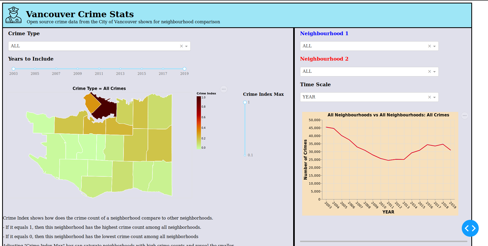

# DSCI-532-Group108

Team members: Frank Lu, Derek Kruszewski, Tao Guo  

## Description of APP  
This APP shows Vancouver's historical crime data in geo-temporal form. It displays a choropleth of City of Vancouver for showing neighbourhood crime comparisons and a line chart for showing individual neighbourhood crime trends.
  
On the choropleth (crime map), the number of crimes in different neighbourhoods is normalized and colour-coded so that users relate the count of a crime type to its relative location in Vancouver. A dropdown list is provided for choosing the crime type. There is also a slider bar for changing the year range of the crime data in case some users are interested in more recent crime data. A second slider bar is provided to change the color saturation of the choropeth to different maximum crime indexes. This allows the user to remove high crime neighbourhood outliers and still show color comparisons for lower crime neighbourhoods.
  
In the line chart (crime trend chart), the count of crimes in a neighbourhood is shown as varied over a time scale. Two dropdowns are provided for selecting two neighbourhoods, and another for selecting the time scale.

## Functionalities
- Crime Type: A drop down box that lets the user select the crime types occuring from 2003 to 2019. Default crime is all crime types combined together.
- Years to Include: From 2003 to 2019. Select the year ranges. Default year range is from 2003 to 2019.
- Neighbourhood 1: Neighbourhoods in Vancouver. Default is all neighbourhoods.
- Neighbourhood 2: Neighbourhoods in Vancouver. Default is all neighbourhoods.
- Time Scale: Select from year, month, day of the week or hour. Default time scale is year.
- The Crime Index: A threshold that change the colour across all neighbourhoods in Vancouver. Default threshold is 1.

## APP Link

https://dsci-532-group108-milestone3.herokuapp.com/

Since we used `sf` package in our project so we cannot deploy the app on heroku per [Firas's message on Slack](https://ubc-mds.slack.com/archives/C24J4AW3Z/p1576255148006900)

Please [download](https://github.com/UBC-MDS/DSCI-532-Group108-R/archive/master.zip)/clone our repository and run it locally. 

## APP Screenshot

We made this screenshot on 

## Data Source

[Vancouver Police Department](https://geodash.vpd.ca/opendata/)

<a href="https://icons8.com/icon/49098/police">Police icon by Icons8</a>